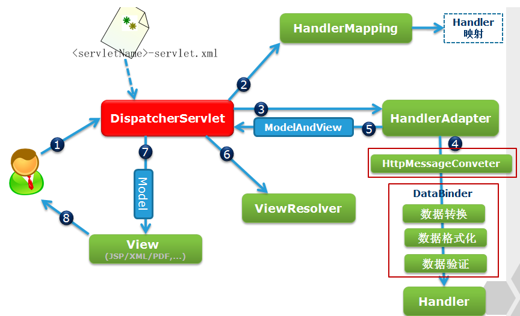

[[toc]]

---
## spring MVC
### 原理
整体流程  

- DispatcherServlet 会请求处理器映射器 HandlerMapping 寻找处理该请求的 Handler（或带拦截器的Handler链）
- DispatcherServlet 会根据找到的 Handler 与配置的处理器适配器 HandlerAdapter

基本概念
- 处理器映射器 HandlerMapping ：在spring源码中，HandlerMapping是一个接口类，实现它的有两类: AbstractUrlHandlerMapping 、AbstractHandlerMethodMapping。@Controller 和 @RequestMapping 这样注解方式用到的处理器映射器为AbstractHandlerMethodMapping子类RequestMappingHandlerMapping ； 映射器会将各自对应映射的handler在容器初始的时候进行缓存 ； 不同的映射处理器映射出来的 handler 对象是不一样的，AbstractUrlHandlerMapping 映射器映射出来的是 handler 是 Controller 对象，AbstractHandlerMethodMapping 映射器映射出来的 handler 是 HandlerMethod 对象。
- 适配器HandlerAdapter ： 通过适配器实际调用处理函数，将返回的String、View、ModelMap或是ModelAndView统一转换为一个ModelAndView对象
- 视图解析器 ： 它接受 DispatcherServlet传过来的ModelAndView，然后将ModelAndView数据填充到相应的视图中，然后返回一个带有数据的视图再传给DispatcherServlet.  
在SpringMVC中可以同时定义多个ViewResolver视图解析器，然后它们会组成一个ViewResolver链 
```
InternalResourceViewResolver 	将逻辑视图名解析为一个路径
BeanNameViewResolver 	将逻辑视图名解析为bean的name属性，从而根据name属性去找对应的bean
ResourceBundleResolver 	和BeanNameViewResolver一样，只不过定义的view-bean都在一个properties文件中，用这个类进行加载这个properties文件
XmlViewResolver 	和ResourceBundleResolver一样，只不过定义的view-bean在一个xml文件中，用这个类来加载xml文件
UrlBasedViewResolver 	它简单实现了ViewResolver接口, 不用任何映射就能通过逻辑视图名称访问资源
VelocityViewResolver 	对Velocity模版引擎的支持
FreeMarkerViewResolver 	对FreeMarker模版引擎的支持
```
### 源码
- DispatcherServlet 类 
    - initStrategies 方法，初始化
    - doService 方法 ，解析url、调用doDispatch方法
    - doDispatch 方法，获取Handler、HandlerAdapter 并执行获取ModelAndView
- HandlerMapping    
- HandlerAdapter
- ViewResolver

### filter
spring boot 配置自定义 filter 几种方式
- 自动扫描
```java
@WebFilter(filterName = "authFilter", urlPatterns = "/*")
@Order(1)
public class MyFilter implements Filter {
    @Override
    public void doFilter(ServletRequest request, ServletResponse response, FilterChain chain) throws IOException, ServletException {
    }
}
```
```java
@ServletComponentScan() 
@SpringBootApplication
public class Application {
    public static void main(String[] args) {
        SpringApplication.run(Application.class, args);
    }
}
```
- 手动配置
```java
@Component
public class MyFilter implements Filter {
    @Override
    public void doFilter(ServletRequest request, ServletResponse response, FilterChain chain) throws IOException, ServletException {

    }
}
```
```java
@Configuration
public class FilterConfig {
    @Autowired
    private MyFilter myFilter;
    @Bean
    public FilterRegistrationBean registerMyFilter() {
        FilterRegistrationBean registration = new FilterRegistrationBean();
        registration.setFilter(myFilter);
        registration.addUrlPatterns("/*");
        registration.setName("myFilter");
        registration.setOrder(1); 
        return registration;
    }    
}
```
springmvc 内置 filters
  - CharacterEncodingFilter,两种配置方式
  ```
  spring boot 已经在 spring-boot-autoconfigure.jar 的 HttpEncodingAutoConfiguration实现自动配置

  只需在xml中通过以下一些参数配置即可
  # 设置的编码，默认为：UTF-8
  spring.http.encoding.charset=UTF-8

  # 是否启用 CharacterEncodingFilter，如果不配置也代表 true
  spring.http.encoding.enabled=true

  # 是否强制设置请求和响应的编码格式为设置的编码格式
  spring.http.encoding.force=

  # 是否强制设置请求的编码格式为设置的编码格式
  spring.http.encoding.force-request=

  # 是否强制设置响应的编码格式为设置的编码格式
  spring.http.encoding.force-response=  
  ```
  手动代码配置中注入bean
  ```java  
  @Configuration
  public class MyFilterConfig {
    @Bean
    public FilterRegistrationBean<Filter> myCharaterEncoding(){
      FilterRegistrationBean<Filter> myFilter = new FilterRegistrationBean<>();
      CharacterEncodingFilter encodingFilter = new CharacterEncodingFilter();
      encodingFilter.setForceEncoding(true);
      myFilter.setFilter(encodingFilter);
      myFilter.addUrlPatterns("/*");
      return myFilter;
    }
  }
  ```
  - CorsFilter


filter vs spring interceptor
- interceptor 直接访问静态资源的请求则没办法进行拦截处理

- HttpMessageConverter，Spring内置了很多HttpMessageConverter，比如MappingJackson2HttpMessageConverter，StringHttpMessageConverter等，也可自定义。

### 注解及参数
- @ResponseBody ，类或方法上,底层通过HttpMessageConverter实现

```
@RestController = @Controller + @ResponseBody
@RestControllerAdvice = @ControllerAdvice + @ResponseBody
@GetMapping = @RequestMapping(method={GET})
@PostMapping = @RequestMapping(method={POST})
@PutMapping = @RequestMapping(method={PUT})
@DeleteMapping = @RequestMapping(method={DELETE})
@PatchMapping = @RequestMapping(method={PATCH})
```
- URL pattern
- @PathVariable 对应url路径中的变量
- @PathParam javax注解，对应url参数中的变量
- @RequestParam
- @RequestBody 底层通过HttpMessageConverter实现

- @ControllerAdvice 
- @RestControllerAdvice
- @Modelttribute

view controllers,由于某些controller只是简单用于没有任何业务逻辑的跳转，所以用此来统一管理，也避免创建过多controller

后端向前端传数据方式
- Map
- Model
- ModelMap ，替代request.setAttribute()作用，向前端传递数据。
- ModelAndView

controller 类中方法参数


### view


### Spring MVC Test

### 其它
#### redirect 与 forward
redirect 三种方式
```java
@GetMapping(value="/testredirect")  
public String testredirect(HttpServletResponse response){  
    response.sendRedirect("/index");
    return null; 
}
```
```java
@GetMapping(value="/testredirect")  
public String testredirect(){  
    return "redirect:/index";
}
```
```java
@GetMapping(value="/testredirect")  
public ModelAndView testredirect(){  
    ModelAndView  model = new ModelAndView("redirect:/main/index"); 
    //传递参数
    model.addObject("userName", userName);   
    return model; 
}
```
#### CORS

#### 文件上传 Multipart
## spring boot
### 自动配置
例如spring mvc相关的自动配置紧密关联的class文件有
- WebMvcAutoConfiguration，默认的自动配置内容
- WebMvcProperties ，对应配置文件中的属性

条件注解，spring 4.0引入的新特性
- @ConditionalOnMissingBean 如果spring容器中无此bean才注入，例如		@ConditionalOnMissingBean(name = "viewResolver", value = ContentNegotiatingViewResolver.class)
- @ConditionalOnBean 如果spring容器中此bean才注入，例如 @ConditionalOnBean(ViewResolver.class)
- @Condition